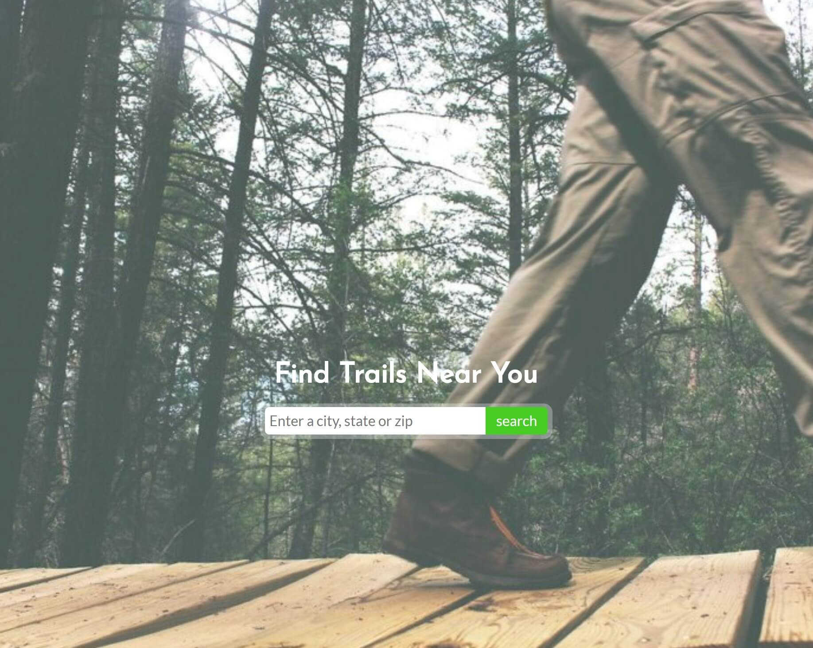
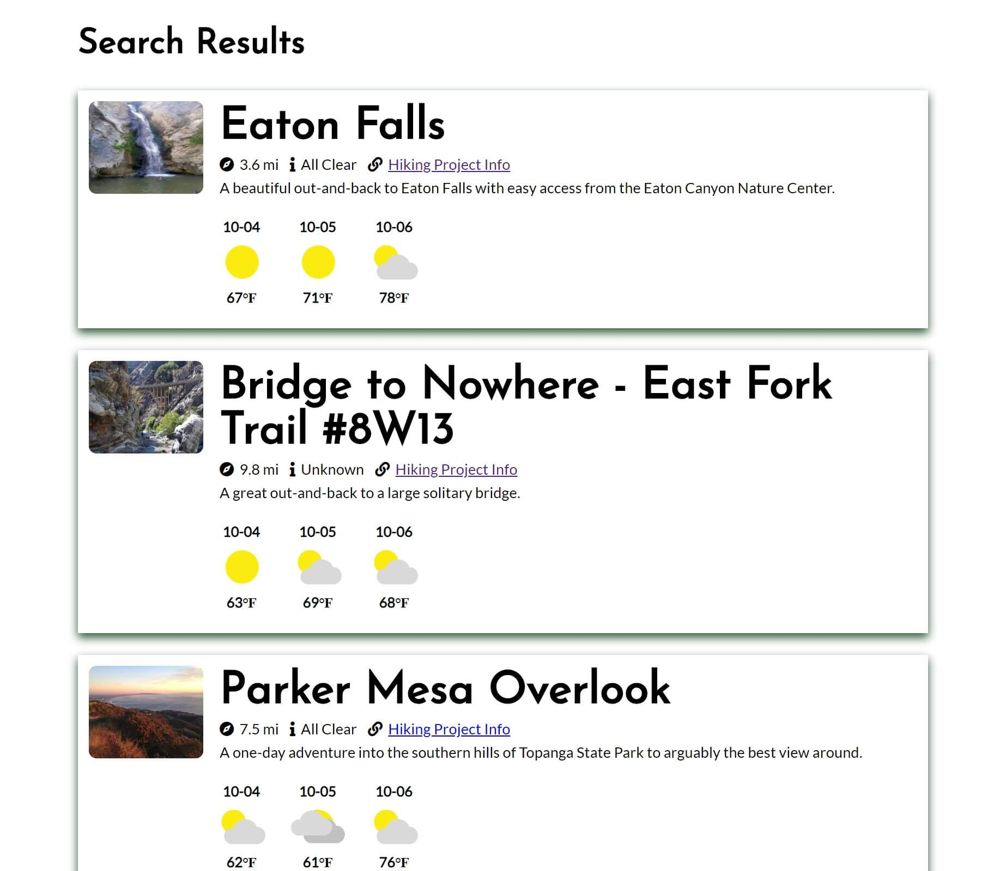

<!-- The name of your app at the top of the file -->
Trail Buddy Hiking App

<!-- A link to your live app -->
https://mmbmf1.github.io/api-hack/

<!-- Screenshot(s) of your app. This makes your app description much easier to understand. -->

Landing Page:

Results Page:

<!-- A summary section. This should have a concise explanation of what your app does. Try to frame this from the standpoint of what the user does, or what the app enables for the user. -->

A user can input a location (city, state or zip code), and a list of 15 neaby trails will display with some brief info. A link to additional trail info and the 3 day forecast for the trail is also displayed.

<!-- A section on the technology used. For your capstone, this is fairly simple (HTML/CSS/JavaScript/jQuery) but it's still good to list out the key technologies -->

Technologies Used:

	HTML
	CSS
	JavaScript
	jQuery

